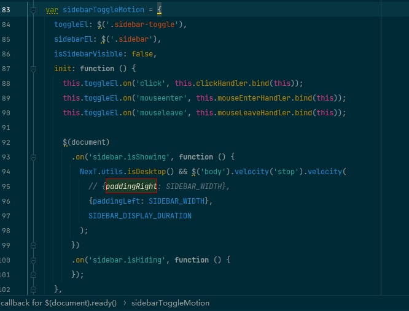
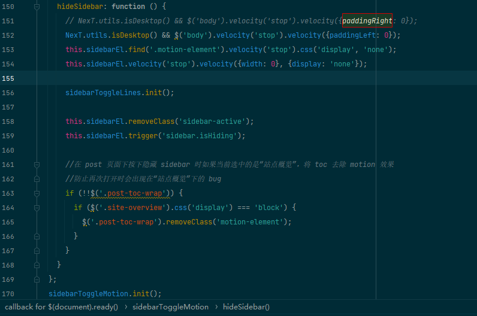
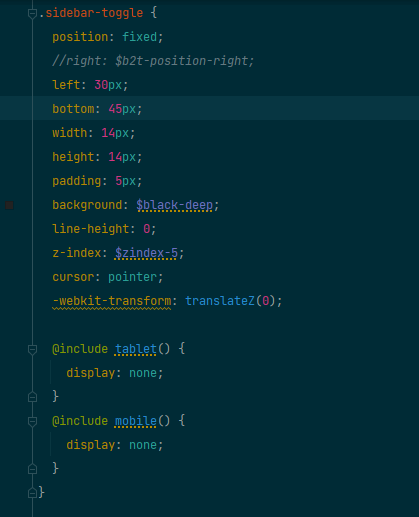

# next 常规修改套路

几乎所有的配置都在_config.yml之中。

## 基础配置

基础配置很简单。

```yaml
# Site
title: Vi_error's Home
subtitle:
description: Some notes, some thoughts, sometimes relax
author: Vi_error
# Support language: de, en, fr-FR, id, ja, ko, pt-BR, pt, ru, zh-Hans, zh-hk, zh-tw
language: zh-Hans
date_format: '%Y-%m-%d'
```

## 头像
```yaml
# Sidebar Avatar
# in directory: /assets/images/avatar.gif
avatar: /assets/images/avatar.jpg
```

## menu


```yaml
menu:
  home: /
  categories: /categories/
  about: /about/
  archives: /archives/
  tags: /tags/
#  sitemap: /sitemap.xml
  commonweal: /404.html

```

# 手动修改sidebar
原因当然是_config.yml中的sidebar配置不生效=，=

找到 motion.js 文件，全文搜索  paddingRight ，修改成下图的样子





修改对应的css样式表，找到 sidebar-toggle.scss

