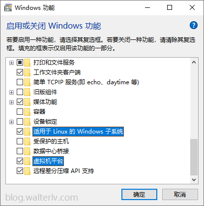

# 背景

最近做了一些apisix相关的开发工作，要进行lua插件开发和运行时调试。

windows电脑的困境再次出现，lua+luarocks在windows上也不是不能装，但是配置到真的能用的程度难度非常之高。

为了在windows上配置开发环境，我手动安装配置编译环境，在windows上make
install安装了lua，又非常艰难的配置安装了luarocks，终于使得lua和luarocks都安装成功。

但是事情并没有就此结束，使用luarocks安装包成功之后，在lua代码中仍然不能通过require使用，代码仍然提示
“module 'xxx' not found”。

又经历了一番艰难的挣扎之后，手动安装socket成功，但是lua-cjson又是一道难题。

无法接受每个依赖都需要大量的手工配置才能安装，只能另觅出路。

在wsl1和2刚出现的时候，曾经是用过一段时间的wsl安装docker方便日常开发，后来因为开发服务器逐渐富裕放弃了wsl。在当下这个场景，wsl似乎又成为了比较好的选择：

- wsl2产品和生态已经逐渐成熟，能够承担一些基本的开发工作；
- wsl打通了和windows文件的互相访问，这能保证开发过程中不会感觉到明显的系统割裂感，不像远程服务器在文件和配置上需要额外处理；
- wsl上安装lua、luarocks、idea都是原生linux体验，成本很低

其实就是，有基础、成本低、能满足需求。

# 环境搭建

需要安装配置的环境工具：

- wsl2
- ubuntu20.04
- mobaxterm
- lua
- luarocks
- idea（Ubuntu）

mobaxterm的安装就不单独说了，主要就是比较好用。我也重新下载了新版的powershell尝试使用，尝试之后觉得还是mobaxterm舒服。

## 安装wsl2+ubuntu-20.04

wsl的安装主要是参考微软官方的文档：[官方文档](https://docs.microsoft.com/en-us/windows/wsl/install)。

首要要保证本机开启了wsl所需要的功能：虚拟机平台和适用于Linux的子系统。

```shell
Enable-WindowsOptionalFeature -Online -FeatureName VirtualMachinePlatform
Enable-WindowsOptionalFeature -Online -FeatureName Microsoft-Windows-Subsystem-Linux
```

执行完这两条命令之后会提示重启，按“Y”确认重启。

也可以在GUI页面打开功能，在windows功能页面，选择启用或关闭windows功能，勾选相应选项



安装ubuntu-20.04

```shell
wsl --set-default-version 2
```

在MicroSoft Store搜索ubuntu，找到20.04版本，选择下载安装。

这里一般不会出什么问题，安装之后会让你选择输入用户名和密码，然后就可以使用了。

此刻重启mobaxterm，会看到WSL-Ubuntu-20.04自动出现在session列表中，就可以使用mobaxterm访问了。

## 安装lua和luarocks

依赖包准备：

```shell
sudo apt update
sudo apt upgrade
sudo apt install g++
sudo apt install make
sudo apt install build-essential libreadline-dev unzip
```

上面这些依赖是安装编译需要的，然后开始安装lua和luarocks。

```shell
wget http://www.lua.org/ftp/lua-5.4.4.tar.gz
tar zxpf lua-5.4.4.tar.gz
cd lua-5.4.4
make linux test
sudo make install

wget https://luarocks.org/releases/luarocks-3.9.1.tar.gz
tar zxpf luarocks-3.9.1.tar.gz
cd luarocks-3.9.1
./configure && make && sudo make install
sudo luarocks install luasocket
```

不得不说在linux环境下配置环境实在是太省心了，开始验证安装。

```shell
luarocks --version
# /usr/local/bin/luarocks 3.9.1
# LuaRocks main command-line interface
luarocks list
# Rocks installed for Lua 5.4
# ---------------------------
# luasocket
#    3.1.0-1 (installed) - /usr/local/lib/luarocks/rocks-5.4
lua
# Lua 5.4.4  Copyright (C) 1994-2022 Lua.org, PUC-Rio
# >
require "socket"
# table: 0x55f4146a1f10   /usr/local/share/lua/5.4/socket.lua
```

展示如上所示则大功告成。


## 安装idea并且配置插件和sdk

idea也非常好安装。
```shell
wget https://download.jetbrains.com.cn/idea/ideaIC-2022.2.1.tar.gz
tar zxpf ideaIC-2022.2.1.tar.gz
cd ideaIC-2022.2.1
cd bin
./idea.sh
```
会弹出idea的GUI，对应的是wsl中的idea，在idea中打开wsl中的功能就可以开发了。

idea中需要配置lua的sdk位置和安装EmmyLua插件，不贴图了。

PS.为什么选择idea开发lua而不是vs这种更为轻量化的ide。 客观的说，vs code+ 插件的方式可能更容易配置和使用，但是作为一名的java的程序员，idea是最为趁手的武器，另外配置wsl环境后期也不排除在上面进行Java开发的可能性，所以直接安装idea成本低，后面不用烦。


## 关于ubuntu版本
在配置环境的过程中并非一开始就选择了ubuntu-20.04版本。

最新的总是最香的，一开始选择了ubuntu-22.04版本，但是在配置过程中遇到了诸多问题，比如界面乱码，软件不兼容，luarocks配置无效等等，在做了诸多努力之后，觉得这个版本违背了搭建环境的初衷，所以切换回了正值壮年的20.04版本。

也许后面还会尝试新版本和新特性，但是当前的诉求，还是有个稳定可用的开发环境。

# 补充一些相关报错和处理

## 启动idea报错：java.awt.AWTError: Can't connect to X11 window server using ':0.0' as the value of the DISPLAY variable.

尝试22.04版本的时候启动idea一直失败，提示这个错误。参照微软官方文档解决：[Run Linux GUI apps on the Windows Subsystem for Linux](https://docs.microsoft.com/en-us/windows/wsl/tutorials/gui-apps)

## 安装lua-cjson使用报错：Symbol not found: _lua_objlen

安装lua-cjson成功，使用时报上述错误，参照github issue切换版本解决：[ Symbol not found: _lua_objlen #56 ](https://github.com/mpx/lua-cjson/issues/56)

```shell
luarocks remove lua-cjson
luarocks install lua-cjson 2.1.0-1
```