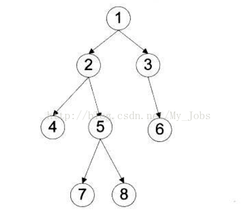

Leetcode算法手感练习中发现很多题的官方解答都会有Morris算法的解法，在前中后序遍历方法中，除掉常规DFS和迭代，Morris也是一种实现方式，并且相对于常规时间，在空间复杂度上实现了O(
1)，如果想在算法题中获得超越99%人的，Morris大概是必须要学会的东西了。

# 实现原理

相对于一般的遍历算法，Morris的最大差异时，它通过临时对子节点引用的修改来实现“后继”节点的保存，之后再次遍历到时恢复树的结构实现了占用空间的压缩。

上面这句话是对Morris最直观的没描述，但是直到我把算法写清楚之前，都无法理解这句话描述的过程。

## 中序遍历的Morris实现

以中序遍历为例说明Morris算法，中序遍历的顺序是： 左，根，右。

一开始是参考leetcode的官方解答尝试理解中序遍历，给出的过程如下：


> 1. 如果 node 无左孩子，先将 node 的值加入答案数组，再访问 node 的右孩子，即 node=node.right
> 2. 如果 node 有左孩子，则找到 node 左子树上最右的节点（即左子树中序遍历的最后一个节点，node 在中序遍历中的前驱节点），我们记为 predecessor。根据 predecessor
>    的右孩子是否为空，进行如下操作
>     1. 如果 predecessor的右孩子为空，则将其右孩子指向 node，然后访问 node 的左孩子，即 node=node.left
>     2. 如果 predecessor的右孩子不为空，则此时其右孩子指向 node，说明我们已经遍历完 node 的左子树，我们将 predecessor 的右孩子置空，将 node
>        的值加入答案数组，然后访问 node 的右孩子，即 x=x.right
> 3. 重复上述操作，直至访问完整棵树。

但是这个官方解答中没有给出知识背景和第二步前驱节点的判断逻辑，非常难以理解。此处贴出来，是想说，如果以上执行过程让你看不懂Morris算法，不是你的错。

## 背景知识

理解算法实现，首先要补齐中序遍历的背景知识：
1. 前驱节点，如果按照中序遍历访问树，访问的结果为ABC，则称A为B的前驱节点，B为C的前驱节点。
2. 对于任意一个节点，它的前驱节点是它的左子树上最右子节点；
3. 基于1和2，前驱节点的右子节点一定为空。

给个demo，如下树：



它的中序遍历是： 4，2，7，5，8，1，3，6

对于节点1，它的前驱节点是左子树2的最右子节点8，子节点8没有右节点。

## 算法思路

树的链接是单向的，这句话的意思是，你只能从一个节点找到它的子节点，而不能直接从一个节点找到它的父节点。

这也就决定了给定一棵树，从根节点出发，只能朝一个方向前进，不能返回。

为了完成中序遍历，就必须使用额外的数据的结构存储返回路线。

Morris的核心变化点就是，基于前驱节点的特性，用前驱节点的右节点（树上不可能存在的节点）记录返回的线路，完成空间节约。

如果到这里都还能是清楚理解的，后面的实现就不复杂了。

Morris算法的核心点就在于：

1. 对于任何一个节点，找到它的前驱节点
2. 前驱节点是否被访问过，依据前驱节点是否被访问过执行相应操作
3. 记录从前驱节点回到当前节点的路径

此时再回头看leetcode给出的算法过程

> 1. 如果 node 无左孩子，先将 node 的值加入答案数组，再访问 node 的右孩子，即 node=node.right
> 2. 如果 node 有左孩子，则找到 node 左子树上最右的节点（即左子树中序遍历的最后一个节点，node 在中序遍历中的前驱节点），我们记为 predecessor。根据 predecessor
>    的右孩子是否为空，进行如下操作
>     1. 如果 predecessor的右孩子为空，则将其右孩子指向 node，然后访问 node 的左孩子，即 node=node.left
>     2. 如果 predecessor的右孩子不为空，则此时其右孩子指向 node，说明我们已经遍历完 node 的左子树，我们将 predecessor 的右孩子置空，将 node
>        的值加入答案数组，然后访问 node 的右孩子，即 x=x.right
> 3. 重复上述操作，直至访问完整棵树。

简化描述版本：

1. 访问当前节点时候，先找其前驱节点pre
2. 找到前驱节点pre以后，我们根据其右指针的值，来判断当前节点的访问状态：
   1. pre的右子节点为空，说明当前节点第一次访问，其左子树还没有访问，此时我们应该将其指向当前节点，并访问当前节点的左子树
   2. pre的右子节点指向当前节点，那么说明这是第二次访问当前节点了，也就是说其左子树已经访问完了，此时将当前节点加入结果集中

到这里，可以上代码了

```java
public class Solution {
    public List<Integer> method3(TreeNode root) {
        List<Integer> ans = new LinkedList<>();
        while (root != null) {
            //没有左子树，直接访问该节点，再访问右子树
            if (root.left == null) {
                ans.add(root.val);
                root = root.right;
            } else {
                //有左子树，找前驱节点，判断是第一次访问还是第二次访问
                TreeNode pre = root.left;
                while (pre.right != null && pre.right != root) {
                    pre = pre.right;
                }
                //是第一次访问，访问左子树
                if (pre.right == null) {
                    pre.right = root;
                    root = root.left;
                }
                //第二次访问了，那么应当消除链接
                //该节点访问完了，接下来应该访问其右子树
                else {
                    pre.right = null;
                    ans.add(root.val);
                    root = root.right;
                }
            }
        }
        return ans;
    }
}
```

Morris算法学习基本完成，再去刷几道题巩固一下，完成~


# 附：中序遍历的递归实现和迭代实现

## 递归实现

```java
public class Solution {
    public List<Integer> inorderTraversal(TreeNode root) {
        List<Integer> result = new ArrayList<>();
        recursion(root, result);
        return result;
    }

    public static void recursion(TreeNode treeNode, List<Integer> list) {
        if (treeNode == null) {
            return;
        }
        recursion(treeNode.left, list);
        list.add(treeNode.val);
        recursion(treeNode.right, list);
    }
}
```

## 迭代实现

```java
public class Solution {
    public List<Integer> inorderTraversal(TreeNode root) {
        List<Integer> res = new ArrayList<Integer>();
        Deque<TreeNode> stk = new LinkedList<TreeNode>();
        while (root != null || !stk.isEmpty()) {
            while (root != null) {
                stk.push(root);
                root = root.left;
            }
            root = stk.pop();
            res.add(root.val);
            root = root.right;
        }
        return res;
    }
}
```