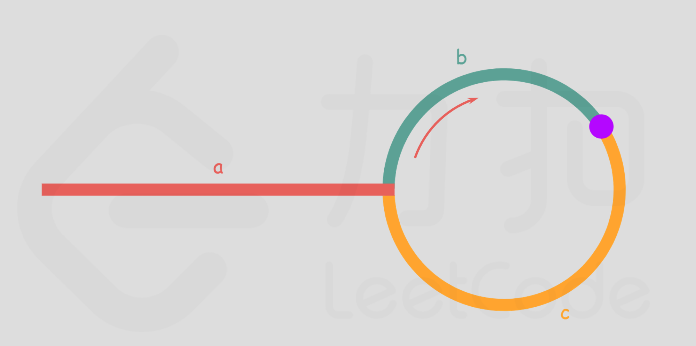

# 环状检测

[LeetCode 141 环状链表](https://leetcode.cn/problems/linked-list-cycle/description/)

这个题目唯一算得上难度的部分是怎么判断节点已经出现，且这个部分只出现在普通解法中。

## 普通解法

先看普通解法。

遍历这个链表，如果链表中的节点已经出现过，那么这个链表就存在环。

在这个题目中，判断是否存在只需要看下节点值是否已经访问过，实际上这是不严谨的=，=，不过题解中都没有考虑这个问题，这个解法也不推荐，不纠结。

伪代码思路：

- 创建一个哈希表存储已经访问过的节点
- 创建一个临时节点用于遍历ListNode
- 如果临时节点已经在哈希表中出现，则存在环，不然就检查下一个节点
- 如果所有节点都检查过了，返回没有环

## 快慢指针

快慢指针的思路虽然已经见过了但还是觉得很聪明啊。

快慢指针的思路来自于`Floyd 判圈算法`,也称为龟兔赛跑算法，是一种用于检测链表中是否存在环的算法。
它由 Robert W. Floyd 提出，通过使用两个不同速度的指针来检测环的存在。
这两个指针通常称为“慢指针”（slow pointer） 和“快指针”（fast pointer）。
慢指针每次移动一步，而快指针每次移动两步。
如果链表中存在环，快指针最终会与慢指针相遇；如果链表中不存在环，快指针会在到达链表末端时结束。

伪代码思路：

- 先把空链表和单节点的情况排除掉
- 创建快慢两个指针（ListNode），慢指针就是头节点，快指针就是头节点的next
- 只要快节点不等于慢节点，那就慢指针前进一步，快指针前进两步
- 如果前进的过程中快节点走到了链表的尽头，那么没有换
- 如果快节点等于慢节点了，有环

## 代码

```java
public class Solution {

  public boolean hasCycle(ListNode head) {
    if (head == null || head.next == null) {
      return false;
    }
    ListNode slow = head;
    ListNode fast = head.next;
    while (slow != fast) {
      if (fast == null || fast.next == null) {
        return false;
      }
      slow = slow.next;
      fast = fast.next.next;
    }
    return true;
  }

  public boolean hasCycleBase(ListNode head) {
    ListNode temp = head;
    Set<ListNode> set = new HashSet<>();
    while (temp != null) {
      if (set.contains(temp)) {
        return true;
      }
      set.add(temp);
      temp = temp.next;
    }
    return false;
  }
}
```

# 环状检测plus——返回第一个入环点

[LeetCode 142 环状列表2](https://leetcode.cn/problems/linked-list-cycle-ii/description/)

在上一个题目的基础上增加了要求，需要返回入环点。

如果用普通解法，那么很简单，环状的点将第一个被发现。

不好理解的部分在于，如果在快慢指针的基础上解决这个问题。

首先需要明确的是，快慢指针相遇只能证明有环，并不能证明是第一个入环点。

所以题目在这里成为了数学题，如何根据快慢指针的步长关系求得相遇点和入环点的关系。

引LeetCode的图用一下



> a+(n+1)b+nc=2(a+b)⟹a=c+(n−1)(b+c)
>
> 得出
>
> a=c+(n−1)(b+c)
>
> 所以
>
> 从相遇点到入环点的距离加上 n−1 圈的环长，恰好等于从链表头部到入环点的距离。
>
> 最终算法
>
> 当发现slow与fast相遇时，我们再额外使用一个指针 ptr。起始，它指向链表头部；随后，它和 slow每次向后移动一个位置。
> 最终，它们会在入环点相遇

```java

public class Solution {

  public ListNode detectCycle(ListNode head) {
    if (head == null) {
      return null;
    }
    ListNode slow = head, fast = head;
    while (fast != null) {
      slow = slow.next;
      if (fast.next != null) {
        fast = fast.next.next;
      } else {
        return null;
      }
      if (fast == slow) {
        ListNode ptr = head;
        while (ptr != slow) {
          ptr = ptr.next;
          slow = slow.next;
        }
        return ptr;
      }
    }
    return null;
  }

  public ListNode detectCycleBase(ListNode head) {
    Set<ListNode> set = new HashSet<>();
    ListNode tmp = head;
    while (tmp != null) {
      if (set.contains(tmp.next)) {
        return tmp.next;
      }
      set.add(tmp);
      tmp = tmp.next;
    }
    return null;
  }
}
```