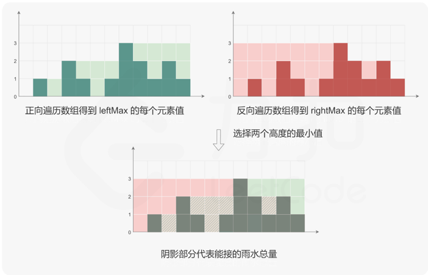

# 题目分析

首先题目在这里：[LeetCode 接雨水](https://leetcode.cn/problems/trapping-rain-water/description/)

这道题的热门和经典程度可以借用某一条评论：
> 据说字节的清洁工阿姨和保安大叔都会做这个题。

做题这件事情虽然有些刻苦用功的意思在，很难说得上轻松愉快，不过在某一些题目的解法中，那些灵光一闪的题解，真的能让人豁然开朗和智力的光。

这道题也让我有这种感觉，来自这张图



小时候经常对一些题有一些冒出来的巧妙的解法，大概就是那种感觉。

# 动态规划解法
动态规划解法就是上面这张图。

针对这张图，从左往右所有浅绿色的部分是；
```
  public void trapLeft(int[] height) {
    int[] leftMax = new int[height.length];
    leftMax[0] = 0;
    int max = height[0];
    for (int i = 1; i < height.length; i++) {
      leftMax[i] = height[i] < max ? max - height[i] : 0;
      max = Math.max(height[i], max);
    }
    System.out.println(Arrays.toString(leftMax));
  }
```

从右往左所有浅红色的部分是：
```
  public void trapRight(int[] height) {
    int[] rightMax = new int[height.length];
    rightMax[height.length - 1] = 0;
    int max = height[height.length - 1];
    for (int i = height.length - 2; i >= 0; i--) {
      rightMax[i] = height[i] < max ? max - height[i] : 0;
      max = Math.max(height[i], max);
    }
    System.out.println(Arrays.toString(rightMax));
  }
```

那么可得交叠的部分为：

```
  public int trap(int[] leftMax, int[] rightMax) {
    int ans = 0;
    for (int i = 0; i < leftMax.length; i++) {
      ans += Math.min(leftMax[i], rightMax[i]);
    }
    return ans;
  }
```
最后得到合并方法
```
  public int trapOwn(int[] height) {
    int length = height.length;
    if (length == 0) {
      return 0;
    }
    int[] leftMax = new int[height.length];
    leftMax[0] = 0;
    int max = height[0];
    for (int i = 1; i < height.length; i++) {
      leftMax[i] = height[i] < max ? max - height[i] : 0;
      max = Math.max(height[i], max);
    }
    System.out.println(Arrays.toString(leftMax));

    int[] rightMax = new int[height.length];
    rightMax[height.length - 1] = 0;
    max = height[height.length - 1];
    for (int i = height.length - 2; i >= 0; i--) {
      rightMax[i] = height[i] < max ? max - height[i] : 0;
      max = Math.max(height[i], max);
    }
    System.out.println(Arrays.toString(rightMax));

    int ans = 0;
    for (int i = 0; i < leftMax.length; i++) {
      ans += Math.min(leftMax[i], rightMax[i]);
    }
    return ans;
  }

```

这个方法的优势，特别的好理解，劣势，提交之后大概率排名垫底。

# 双指针

双指针是针对dp方法的优化。

```
public int trap(int[] height) {
    // 特殊情况处理：如果数组为空或者长度为0，则没有雨水可以积累，直接返回0
    if (height == null || height.length == 0) return 0;

    // 初始化双指针
    int left = 0; // 左指针，从数组最左端开始
    int right = height.length - 1; // 右指针，从数组最右端开始

    // 初始化左、右两边最高的柱子高度
    int left_max = 0; // 当前左边的最高柱子高度
    int right_max = 0; // 当前右边的最高柱子高度

    // 结果变量，累计雨水量
    int ans = 0;

    // 当左指针小于右指针时进行循环
    while (left < right) {
        // 如果左边的高度小于右边
        if (height[left] < height[right]) {
            // 更新左边的最高柱子高度
            if (height[left] >= left_max) {
                left_max = height[left]; // 当前高度大于等于left_max，更新left_max
            } else {
                // 当前高度小于left_max，计算当前柱子可以存储的雨水量
                ans += left_max - height[left];
            }
            // 左指针向右移动一位
            left++;
        } else {
            // 如果右边的高度小于等于左边
            if (height[right] >= right_max) {
                right_max = height[right]; // 当前高度大于等于right_max，更新right_max
            } else {
                // 当前高度小于right_max，计算当前柱子可以存储的雨水量
                ans += right_max - height[right];
            }
            // 右指针向左移动一位
            right--;
        }
    }

    // 返回最终累计的雨水量
    return ans;
}

```


# 单调栈

题解中的单调栈描述的不清楚，没有描述关键的入栈和出栈条件。

解题思路是：

利用栈维护高度单调递减（不严格）的柱子下标，这实际上是在维护一个下凹的区域，一旦发现栈顶的元素小于最新的元素，那就意味着找到了一个小小的凹进去的区域。

需要注意的是这个区域可能只是一个大区域中的小部分。

比如柱子的高度是 5，4，3，2，3，5，当遍历到第二个3的时候，实际上我们找到的凹进去的区域时323这一段，实际上两个5之间都是连续的凹进去的。

不过不要担心，当遍历到第二个5的时候，只要明确两个5之间没被计算的部分是 4*2=8就可以了。

一段凹进去的区域之间的积水量始终为:

`Math.min(height[concurrent], height[left])-height[top] * (concurrent-top-1)`

入栈条件：
- 当前柱子的高度不大于栈顶柱子的高度时，将当前柱子下标入栈
- 保持栈中的高度是递减的

出栈条件：
- 当前柱子的高度大于栈顶柱子的高度时，栈顶柱子出栈
- 通过出栈操作找到能够形成的积水区域，计算雨水量

```
  public int trapStack(int[] height) {
    int ans = 0;
    Stack<Integer> stack = new Stack<>();
    for (int i = 0; i < height.length; i++) {
      while (!stack.isEmpty() && height[i] > height[stack.peek()]) {
        int top = stack.pop();
        if (stack.isEmpty()) {
          break;
        }
        int left = stack.peek();
        ans += (Math.min(height[left], height[i]) - height[top]) * (i - left - 1);
      }
      stack.push(i);
    }
    return ans;
  }
```