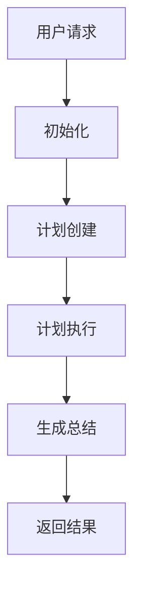
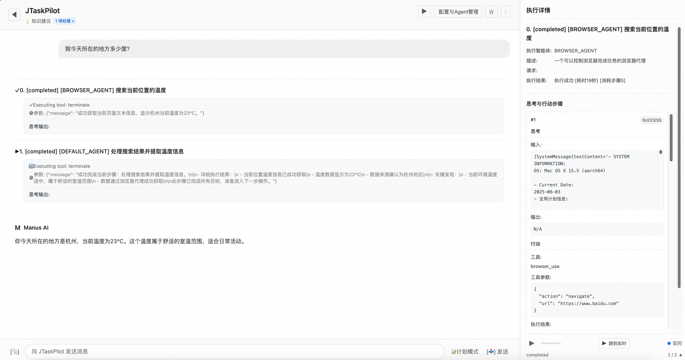
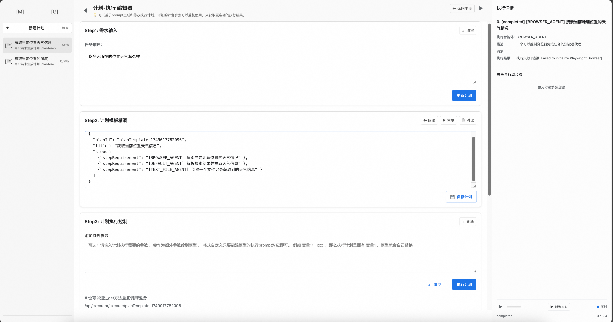
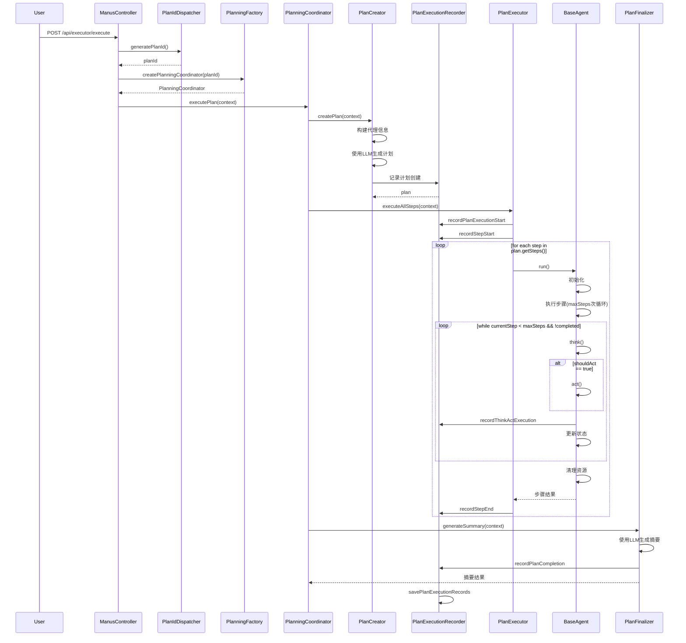
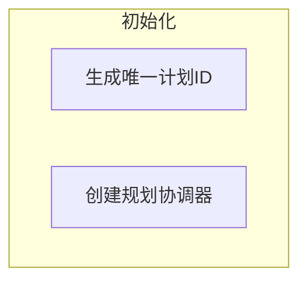
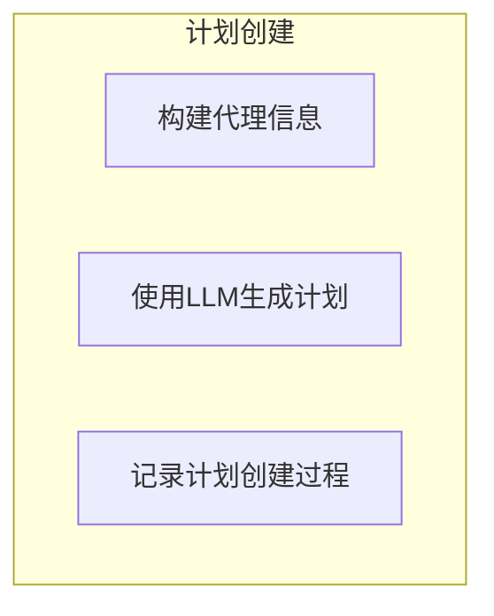
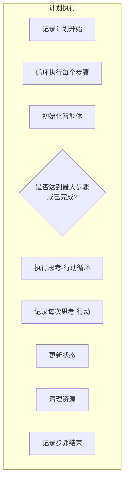
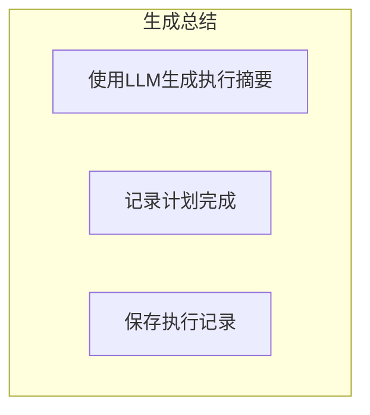

在对Agent的概念有一些基础理解之后，现在面临第二个问题：如果想要完成一个Agent工程的开发，需要完成哪些工作。

从技术视角理解这个问题最直接的方式是下载一个开源Agent，本地搭建环境之后，逐步debug直到理解流程。

我选Manus（的开源版本）。

# 为什么选Manus

Manus是一个标志性的产品，被认为是通用Agent的开端，它的热度不仅体现在邀请码一码难求，也体现在相似开源产品的快速出现。

Agent产品的发展大概有这么一条脉络：

```mermaid
graph LR
    A[IBM Watson] --> B[Siri/Cortana]
    B --> C[AutoGPT/BabyAGI]
    C --> D[LangChain Agents]
    D --> E[ChatGPT Plugins]
    E --> F[HuggingGPT]
    F --> G[Manus / JManus]
    G --> H[未来多模态 Agent]

    style A fill:#bbf,stroke:#333
    style B fill:#bbf,stroke:#333
    style C fill:#f9c,stroke:#333
    style D fill:#f9c,stroke:#333
    style E fill:#f9c,stroke:#333
    style F fill:#f9c,stroke:#333
    style G fill:#f9f,stroke:#333
    style H fill:#dfd,stroke:#333

    classDef research fill:#bbf,stroke:#333;
    classDef openSource fill:#f9c,stroke:#333;
    classDef product fill:#f9f,stroke:#333;

    class A,B research
    class C,D,E,F openSource
    class G,H product
```


LLM之前我们就拥有了Siri这样的语音助手，LLM之后Agent从懵懂的尝试逐渐专业和复杂，到Manus已经完整了Agent任务处理线索，选择Manus没有问题。

# Agent设计中的挑战和Jmanus的应对

这一部分本来是要写在文章最后的，实际上这部分也是在完成Jmanus分析之后才开始写的，但是因为Jmanus的分析实在太长了，阅读需要很多时间，所以就把结论的部分放到上面。

## 准备阅读Jmanus之前的问题

上一篇大致理解了为什么会有Agent以及Agent大概会有哪些挑战。Lilian Weng明确提出的有：

> Finite context length: The restricted context capacity limits the inclusion of historical information, detailed instructions, API call context, and responses. The design of the system has to work with this limited communication bandwidth, while mechanisms like self-reflection to learn from past mistakes would benefit a lot from long or infinite context windows. Although vector stores and retrieval can provide access to a larger knowledge pool, their representation power is not as powerful as full attention.
> 
> Challenges in long-term planning and task decomposition: Planning over a lengthy history and effectively exploring the solution space remain challenging. LLMs struggle to adjust plans when faced with unexpected errors, making them less robust compared to humans who learn from trial and error.
> 
> Reliability of natural language interface: Current agent system relies on natural language as an interface between LLMs and external components such as memory and tools. However, the reliability of model outputs is questionable, as LLMs may make formatting errors and occasionally exhibit rebellious behavior (e.g. refuse to follow an instruction). Consequently, much of the agent demo code focuses on parsing model output.

附翻译：

> 有限上下文长度：受限上下文容量限制了历史信息、详细说明、API 调用上下文和响应的包含。系统的设计必须与这种有限的通信带宽一起工作，而像自我反思这样从过去的错误中学习的机制将从长或无限的上下文窗口中受益匪浅。尽管向量存储和检索可以提供对更大知识库的访问，但它们的表示能力不如全神贯注强大。
> 
> 长期规划和任务分解中的挑战：在漫长的历史中进行规划并有效探索解决方案空间仍然具有挑战性。LLM 在面临意外错误时难以调整计划，与从反复试验中学习的人类相比，它们不那么强大。
> 
> 自然语言接口的可靠性：当前的代理系统依赖于自然语言作为 LLM 与外部组件（如内存和工具）之间的接口。然而，模型输出的可靠性值得怀疑，因为 LLM 可能会犯格式错误，偶尔会表现出叛逆行为（例如拒绝遵循指令）。因此，大部分代理演示代码都侧重于解析模型输出。

对照Agent工具的设计实现，我们至少可以get到一些实际上的挑战：

- 为了能让模型理解一轮长对话中信息，在Agent调用模型时我们可以选择把本轮对话所有的信息都重复的丢给模型，但是context的长度不是无限的，context中也不是所有的信息都是有效的；如何扩展或者整理这些信息才能让真正有用的信息发挥作用呢？
- 任务分解会有很多中可能的方式，每一个子任务的执行结果也有不同的效应，Agent怎么获取最好的任务分解计划，怎么在子任务执行结果不佳的时候重试当前步骤或者更换计划，怎么准确的衡量子任务执行的结果？
- 自然语言的描述灵活性很大，对于同一个任务可能会有很多种不同的描述，怎么把不同的描述对应到同一个问题上？
- LLM的幻觉如何被识别和发现？

我们可以带着这些问题去看JManus的设计上如何体现或者规避这些问题。

## Jmanus的设计

### 任务处理主流程
JManus的主流程大概是这样的：



其中：

- 计划的创建对应任务分解
- 计划的执行涉及到子任务的执行和执行结果的判断

这里有两个问题：

1. 任务分解过程可以做哪些优化以保证最佳效果？
2. 任务的执行怎么控制，子任务的状态如何判断？

针对问题1，Jmanus提供以下方式优化或解决：

- 将计划完整的展示给用户，用户可以直观的看到任务分解是否合理，今儿可以选择是否中断并重新提问
- 提供**计划模式**，在计划模式，用户的问题会首先被拆分成子任务展示出来，用户可以选择调整子任务，调整完毕之后再执行，同时，执行计划可以被保存为模版，后续可以继续使用

后端代码逻辑中可以看到，任务分解是由模型完成的，实际测试也会发现，模型针对同一个问题有时可能会给出不同的任务分解计划，最后执行的结果也不一定相同，工程上目前没有直接对这一步做控制，

目前的处理方式更多的是把完整的计划和计划执行结果提供给用户查看，并且提供手动调整计划的能力。

然后是任务执行的控制。Jmanus的任务执行控制主要在PlanExecutor.executeAllSteps中，有这么几个状态(AgentState)：

- NOT_STARTED("not_started"),
- IN_PROGRESS("in_progress"), 
- COMPLETED("completed"), 
- BLOCKED("blocked"),
- FAILED("failed"); 

任务的控制逻辑中会对任务状态进行检查，block的任务会有处理，任务的状态也会被统一的维护，但是单一任务的失败不会影响整个计划。

从设计逻辑上来讲，这个步骤是合理的，因子任务是执行计划的其中一环，单独替换这个任务不一定会有很好的效果，除了重试没有什么额外的办法。

另外有一层对最大步数的检测，如果当前任务执行的步数超过了Agent配置允许执行的最大步数，那么任务将会被置失败。

另外一个需要关注的问题是，即使任务completed，那么效果一定好吗？ 在Agent中如何判断LLM产出的内容一定符合预期？

JManus的定位是通用Agent，在没有固定的业务场景时，这种判断是很难设计的，但是Agent的绝对重点内容。

### 执行结果对Agent进化的价值

执行结果对Agent的价值体现在两个方面：

- 执行结果不达预期时的计划中纠正
- 计划执行结果对后续计划执行的提升：
  - 人工执行结果分析及agent改进
  - 自动执行模型强化训练

为了发挥执行结果的价值，尤其是在自动化场景中的结果使用，首先需要判定计划执行的效果。

Jmanus在流程中对任务执行信息收集的比较完善，但是任务信息的使用上还没有充分扩展，这里列举一些可能的方式：

- 手动反馈，页面提供入口允许用户为结果点赞或者点踩；
- 人工周期性的对计划执行记录进行review，需要注意的是，一旦执行计划的数量变得庞大，这里需要新的系统设计，因此小规模系统或者采样抽查；
- 通过内置规则判断计划执行的效果：
  - 有无明确的返回，是否针对用户提问给出了回答
  - 是否在查询到了明确数据
  - 用户对当前信息的反馈

### Tool的使用

Jmanus能够对MCP服务提供完整的支持，包括sse和stdio两种方式。

MCP作为事实上通用协议，agent的都会逐步提供支持。


# 如果我要设计一个Agent，需要考虑哪些问题


First of all，我们不会尝试去做一个通用的agent，我们的agent一定会和业务场景有一定的结合，产生类似data+ai的效果。

产品视角会有这样的前提：

- agent在一个已有的产品中扩充能力，它主要的业务场景基本就是产品对应的业务场景
- agent会具备一些基础的业务场景case，这些case来自pd，agent需要在这些业务场景上定向优化
- agent也会针对用户通用的不确定的问题做出努力，此时agent是在产品已知业务场景（长期记忆/知识增强）的背景下尝试解决问题

工程视角上，Agent需要具备这样的能力：

- agent system必备的component，每个组件需要各司其职，并且被agent控制中心统一调度
- planning的过程可以查看、修改、记录、review
- 任务执行遵循统一的控制逻辑，每个子任务的执行状态需要单独检测并对任务整体状态有联动
- 要有状态检查的模块，它需要具备判定任务执行、子任务执行结果的优劣；在预设的业务场景中和通用的业务场景中能够支持规则分离；
- prompt管理，能加工用户的输入，包括场景匹配、用户个人信息的输入，上下文关键信息关联，强化LLM的返回
- 管理长期记忆，使LLM具备产品的基础背景知识和用户的个性化设定
- 工具交互模块：
  - 支持Rest API
  - 支持MCP
- 任务执行运维功能：记录和查看任务执行计划，允许修改任务执行计划并重新执行

以上是工程视角上agent至少应该具备的能力，随着业务的发展，肯定还会有更多的能力要求。

作为agent的设计者不会过多的涉及到模型侧的工作，但可以明确完整的链路设计会包括：

- agent和模型对接
- 模型在特定业务场景下训练
- 业务知识库对接

初期可以使用通用模型，但定向调整的模型一定会有更好的效果。

# 总结
ok，到这里本篇的主要内容就已经完成了。

通过学习Jmanus的实现，结合前期了解agent过程中基本认识，现在已经对agent设计有了相对完整的认识。

但在进行真正的agent设计之前，其实还有一些信息需要收集和整理：

- Lilian Weng的文章中提到了一些论文，论文中对每个component的实现方法有所讨论，这些方法是否有更新，我们在设计agent时，是否可以使用
- Manus模式虽然是当前最具查看价值的Agent设计，但进行真正的设计之前，我们还需要1-2个对照产品完善我们的认识
- 现在有很多的LLMops平台提供了agent配置能力，允许用户快速创建自己的agent使用，平台为创建agent设定了什么样的能力范围

写在这里就是给后面留个作业，继续努力。

# Jmanus实现分析

写在最前面，感谢**copilot**和**通义灵码**对本章内容提供的支持，尤其是在我完全没有付费的情况下。

这一步本来是打算直接使用Manus产品和阅读Manus技术文章完成的，没想到公司的网络根本无法打开Manus的官网，访问之后会被直接重定向到空空如也的中国版官网，没办法就把目标瞄上了Manus的开源产品。

Manus最知名的开源产品是OpenManus，然后我又找到了Java生态基于Spring AI Alibaba构建的Jmanus，Java程序员选了Jmanus。

拉取代码，部署试用，debug任务执行流程。

## 本地部署效果



自然语言的输入被拆分成执行步骤，之后逐步执行，最后执行结果被模型收集和分析，得到一个输出结果。

图上的示例问题我执行了多次：

- 第一次执行的时候JManus自己下载了chromium，我本机并没有使用chrome，它需要，所以它就自己下载了一个
- 每次拆分的步骤不尽相同，有时候先查询地点，在查询天气，最后整合，有时候直接查询
- 任务执行的结果也不总是成功，中间有一次失败是因为浏览器的查询结果没有告诉LLM所在的位置，点击左侧的步骤执行，能够看到每一步执行的详情

Jmanus还提供了本地配置Agent的功能，可以自定义自己的agent或者配置某一个agent的特性。

这边提供的Agent配置内容包括：

- 全局配置：Agent最大步数，超时时间，交互模式
- Agent配置：Agent名称、描述、提示词、可用工具
- Tool配置：MCP（Stdio/SSE），没提供 Function Call类型的工具配置

Jmanus有个需要特别注意的模式：计划模式。



如果对agent自己生成的计划不满意，或者已经有固定的场景，那么这个模式就很有帮助。比如我们在Agent产品开发中，如果有一些业务场景是固定的，那么就可以配置固定的计划模版，这就可以提高Agent在制定业务场景下的表现。

我们以debug方式启动服务，在页面输入问题，跟踪任务处理的全过程。

- 页面请求入口为：/api/executor/execute
- 对应的后端代码在：ManusController.executeQuery(@RequestBody Map<String, String> request) 

通过debug可以看到完整的流程。

## 时序图



## 逻辑流程

可以从代码流程中总结对应的逻辑流程，也就是Agent在面临一个具体问题时，究竟完成了哪些工作。

### 总体流程


### 初始化


- 用户通过POST请求/api/executor/execute发送查询
- PlanIdDispatcher生成唯一的计划ID
- PlanningFactory根据计划ID创建PlanningCoordinator
- 创建包含用户请求、计划ID等信息的ExecutionContext

### 计划创建


- PlanningCoordinator调用PlanCreator创建计划
- PlanCreator构建可用代理的信息
- 使用LLM根据用户请求和代理信息生成执行计划
- PlanExecutionRecorder记录计划创建过程

### 计划执行



- PlanningCoordinator调用PlanExecutor执行所有步骤
- PlanExecutor遍历计划中的每个步骤
- 每个步骤由相应的BaseAgent执行：
  - 初始化智能体
  - 执行多步骤循环（最多maxSteps次）
  - 在每次循环中：
    - 决定是否需要采取行动
    - 如果需要，执行具体行动
    - 记录每次思考-行动过程
    - 更新执行状态
  - 清理资源
- 记录每个步骤的开始和结束

### 生成总结



- PlanningCoordinator调用PlanFinalizer生成总结
- PlanFinalizer使用LLM根据执行详情生成用户友好的摘要
- PlanExecutionRecorder记录计划完成状态
- 保存完整的执行记录

## 代码分析


###  `ManusController` - 请求入口点

- **代码文件**: ManusController.java

#### 功能描述：
- 接收用户的POST请求 `/api/executor/execute`
- 创建包含用户请求和计划ID的执行上下文
- 获取或创建规划协调器实例

#### 关键代码：
```java
@PostMapping("/execute")
public ResponseEntity<Map<String, Object>> executeQuery(@RequestBody Map<String, String> request) {
    // 创建ExecutionContext
    ExecutionContext context = new ExecutionContext();
    context.setUserRequest(query);
    
    // 生成唯一的计划ID
    String planId = planIdDispatcher.generatePlanId();
    context.setPlanId(planId);
    
    // 获取规划流程
    PlanningCoordinator planningFlow = planningFactory.createPlanningCoordinator(planId);
    // ...
}
```

---

### `PlanningCoordinator` - 流程协调

- **代码文件**: PlanningCoordinator.java

#### 功能描述：
- 协调计划的创建、执行和总结
- 维护 PlanCreator、PlanExecutor 和 PlanFinalizer 实例

#### 关键代码：
```java
public ExecutionContext executePlan(ExecutionContext context) {
    // 1. 创建计划
    planCreator.createPlan(context);

    // 2. 执行计划
    planExecutor.executeAllSteps(context);

    // 3. 生成总结
    planFinalizer.generateSummary(context);

    return context;
}
```

---

### `PlanCreator` - 计划创建

- **代码文件**: PlanCreator.java

#### 功能描述：
- 根据用户请求和可用代理信息生成执行计划
- 使用LLM生成计划内容
- 通过 PlanningTool 处理工具调用

#### 关键代码：
```java
public void createPlan(ExecutionContext context) {
    // 构建代理信息
    String agentsInfo = buildAgentsInfo(agents);
    
    // 生成计划提示
    String planPrompt = generatePlanPrompt(context.getUserRequest(), agentsInfo, planId);
    
    // 使用LLM生成计划
    PromptTemplate promptTemplate = new PromptTemplate(planPrompt);
    Prompt prompt = promptTemplate.create();

    ChatClientRequestSpec requestSpec = llmService.getPlanningChatClient()
        .prompt(prompt)
        .toolCallbacks(List.of(planningTool.getFunctionToolCallback()));
    
    if (useMemory) {
        requestSpec.advisors(MessageChatMemoryAdvisor.builder(llmService.getConversationMemory()).build());
    }
    
    ChatClient.CallResponseSpec response = requestSpec.call();
    String outputText = response.chatResponse().getResult().getOutput().getText();
    
    // 处理结果
    if (planId.equals(planningTool.getCurrentPlanId())) {
        currentPlan = planningTool.getCurrentPlan();
        log.info("Plan created successfully: {}", currentPlan);
        currentPlan.setPlanningThinking(outputText);
    }
}
```

---

### `PlanExecutor` - 计划执行

- **代码文件**: PlanExecutor.java

#### 功能描述：
- 遍历计划中的所有步骤
- 为每个步骤调用相应的 BaseAgent 执行

#### 关键代码：
```java
public void executeAllSteps(ExecutionContext context) {
    try {
        recordPlanExecutionStart(context);
        ExecutionPlan plan = context.getPlan();
        List<ExecutionStep> steps = plan.getSteps();
        
        for (int i = 0; i < steps.size(); i++) {
            ExecutionStep step = steps.get(i);
            recordStepStart(context, i);
            
            // 执行单个步骤
            BaseAgent executor = getAgentForStep(step);
            executor.run();
            
            recordStepEnd(context, i);
        }
    } catch (Exception e) {
        // 异常处理
    }
}
```

---

### `BaseAgent` - 智能体基类

- **代码文件**: BaseAgent.java

#### 功能描述：
- 实现智能体的基本功能
- 控制执行流程（思考和行动）

#### 关键代码：
```java
public String run() {
    currentStep = 0;
    if (state != AgentState.IN_PROGRESS) {
        throw new IllegalStateException("Cannot run agent from state: " + state);
    }

    // 创建智能体执行记录
    AgentExecutionRecord agentRecord = new AgentExecutionRecord(getPlanId(), getName(), getDescription());
    agentRecord.setMaxSteps(maxSteps);
    agentRecord.setStatus(state.toString());

    if (planId != null && planExecutionRecorder != null) {
        planExecutionRecorder.recordAgentExecution(planId, agentRecord);
    }

    List<String> results = new ArrayList<>();
    try {
        state = AgentState.IN_PROGRESS;
        agentRecord.setStatus(state.toString());

        while (currentStep < maxSteps && !state.equals(AgentState.COMPLETED)) {
            currentStep++;
            log.info("Executing round {}/{}", currentStep, maxSteps);

            AgentExecResult stepResult = step();

            if (isStuck()) {
                handleStuckState(agentRecord);
            } else {
                state = stepResult.getState();
            }

            results.add("Round " + currentStep + ": " + stepResult.getResult());
            agentRecord.setCurrentStep(currentStep);
        }
        // ... 其他代码 ...
    } catch (Exception e) {
        // 异常处理
    } finally {
        state = AgentState.COMPLETED;
        agentRecord.setStatus(state.toString());
        llmService.clearAgentMemory(planId);
    }
    
    return results.isEmpty() ? "" : results.get(results.size() - 1);
}

protected abstract AgentExecResult step();
```

---

### `PlanFinalizer` - 总结生成

- **代码文件**: PlanFinalizer.java

#### 功能描述：

- 使用LLM根据执行详情生成用户友好的总结

#### 关键代码：
```java
public void generateSummary(ExecutionContext context) {
    if (context == null || context.getPlan() == null) {
        throw new IllegalArgumentException("ExecutionContext or its plan cannot be null");
    }
    
    if (!context.isNeedSummary()) {
        String summary = context.getPlan().getPlanExecutionStateStringFormat(false);
        context.setResultSummary(summary);
        recordPlanCompletion(context, summary);
        return;
    }
    
    ExecutionPlan plan = context.getPlan();
    String executionDetail = plan.getPlanExecutionStateStringFormat(false);
    
    // 构建提示模板
    SystemPromptTemplate systemPromptTemplate = new SystemPromptTemplate("""
        您是 jmanus，一个能够回应用户请求的AI助手，
        需要根据这个分步骤的执行计划的执行结果，来回应用户的请求。
        分步骤计划的执行详情：
        {executionDetail}
        """);
    
    Message systemMessage = systemPromptTemplate.createMessage(Map.of("executionDetail", executionDetail));
    
    // 生成响应
    Prompt prompt = new Prompt(List.of(systemMessage, userMessage));
    ChatResponse response = llmService.getPlanningChatClient()
        .prompt(prompt)
        .call()
        .chatResponse();
    
    String summary = response.getResult().getOutput().getText();
    context.setResultSummary(summary);
}
```

---

### `PlanExecutionRecorder` - 执行记录器

- **代码文件**: PlanExecutionRecorder.java

#### 功能描述：
- 记录计划执行过程的关键节点
- 提供持久化存储方法

#### 关键接口定义：
```java
public interface PlanExecutionRecorder {
    String recordPlanExecution(PlanExecutionRecord stepRecord);
    Long recordAgentExecution(String planId, AgentExecutionRecord agentRecord);
    void recordThinkActExecution(String planId, Long agentExecutionId, ThinkActRecord thinkActRecord);
    void recordPlanCompletion(String planId, String summary);
    PlanExecutionRecord getExecutionRecord(String planId);
    boolean savePlanExecutionRecords(String planId);
    void saveAllExecutionRecords();
    AgentExecutionRecord getCurrentAgentExecutionRecord(String planId);
    void removeExecutionRecord(String planId);
}
```