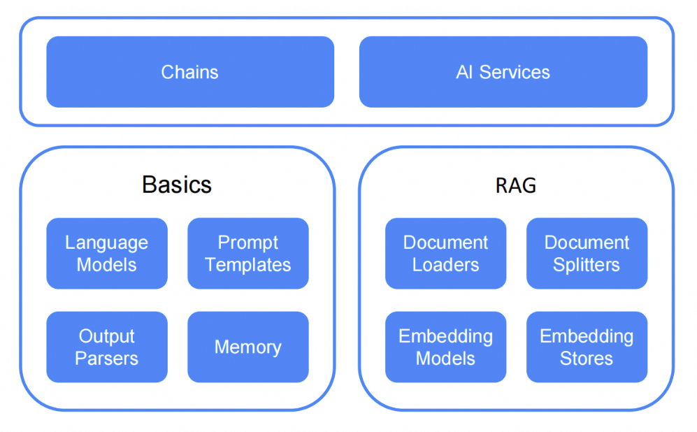

## 选型思路

前几天的工作基本明确了产品侧的agent要怎么开发和实现，接下来就是调研AI/Agent开发框架。

首先选语言，然后选框架。

现在AI技术发展的很快，python作为AI的原生语言可选的框架很多，TypeScript也很活跃，AI厂商经常优先照顾他们，Java和Go依靠社区更多一点，Java更为活跃。

Python和Java是值得讨论的选择，可惜由于Agent的产品设想要在已有的Java工程上直接新增，所以最后调研的范围被限定在了Java语言。

Java语言由于生态非常活跃，还有Spring这种巨无霸框架，其实在技术成熟度上没有什么问题，不会影响产品实现的效果。

Langchain4j是其中一个调研对象。

## 信息收集

- 官网地址：<https://docs.langchain4j.dev/intro>
- git地址：
  - 主工程：<https://github.com/langchain4j/langchain4j>
  - spring集成：<https://github.com/langchain4j/langchain4j-spring>
  - demo工程：<https://github.com/langchain4j/langchain4j-examples>

## 确定需要调研的内容

之前在Manus的调研中研究了开源的Jmanus，这次再看Langchain4j，一开始就很很不一样的感觉。

Jmanus是一个产品，本地部署即可使用，能从产品的功能特点、接口执行链路上清楚的追踪到代码设计逻辑。

Langchain4j是一个Java-AI生态框架，没有完整的功能，需要先去了解平台提供的功能支持，丛中找到自己关心的核心部分再去调研。

我挑选了我需要核心关注的部分是：

- Langchain4j的核心功能包括哪些，框架设计时更侧重提供哪些能力
- 有哪些关键抽象，为什么设计这些抽象，这些抽象为框架使用者提供什么
- 使用Langchain4j完成之前的agent demo工程开发

## 框架的设计思路

### 如果让你设计框架

Langchain4j的设计目标是简化Java应用和大模型的集成工作，假设我们是这个框架的设计者，那么有两部分事情是需要关心的：

- Langchain是如何设计的
- Java语言集成LLM通常需要完成哪些事情

考虑到Langchain4j最初的目标可能是做Java生态的Langchain，那么从Langchain寻找设计灵感就是很自然的事情。

第二个问题可以这么理解，为了完善框架的设计，尤其是需要考虑到Java生态的特殊性，比如庞大的存量的Spring工程，Java复杂的设计模式等等，都有可能需要同时熟悉LLM和Java生态的人在此之上投入心力。

第一个问题对我这个初学者太难了，第二个问题倒是可以参照Jmanus和产品需求讨论一下。

- 首先是模型集成，框架需要帮助开发者从模型集成的细节中摆脱出来，调用LLM能做到配置之外开箱即用
  - 多模型分别管理，灵活切换
  - token统计，分模型管理
  - 流式返回
- 工具集成，这里指的仅仅是MCP/Function Call这个概念的工具
  - 支持MCP，包括stdio、sse和streamable hhtp
  - 支持存量rest接口也作为Tool注册
- RAG构建
  - 针对特定的业务场景构建知识库，对模型定向增强
- Prompt管理
  - 支持LLM级别的，chat Assistant级别的
- 任务控制器
  - Agent执行具体的planning时，task的执行需要执行器控制
- 全链路的log支持

其余需要关注的事情：

- planing有没有较好的优化方案
- 长期记忆如何管理

### 从工程文档初步了解工程结构

> 1. **Unified APIs:**
>    LLM providers (like OpenAI or Google Vertex AI) and embedding (vector) stores (such as Pinecone or Milvus)
>    use proprietary APIs. LangChain4j offers a unified API to avoid the need for learning and implementing specific APIs for each of them.
>    To experiment with different LLMs or embedding stores, you can easily switch between them without the need to rewrite your code.
>    LangChain4j currently supports [15+ popular LLM providers](https://docs.langchain4j.dev/integrations/language-models/)
>    and [15+ embedding stores](https://docs.langchain4j.dev/integrations/embedding-stores/).
> 2. **Comprehensive Toolbox:**
>    Since early 2023, the community has been building numerous LLM-powered applications,
>    identifying common abstractions, patterns, and techniques. LangChain4j has refined these into practical code.
>    Our toolbox includes tools ranging from low-level prompt templating, chat memory management, and function calling
>    to high-level patterns like Agents and RAG.
>    For each abstraction, we provide an interface along with multiple ready-to-use implementations based on common techniques.
>    Whether you're building a chatbot or developing a RAG with a complete pipeline from data ingestion to retrieval,
>    LangChain4j offers a wide variety of options.

翻译成中文：

> 1. 统一 API：
> LLM 提供程序（如 OpenAI 或 Google Vertex AI）和嵌入（向量）存储（如 Pinecone 或 Milvus） 使用专有 API。LangChain4j 提供了一个统一的 API，以避免为每个 API 学习和实现特定的 API。 要试验不同的 LLM 或嵌入存储，您可以轻松地在它们之间切换，而无需重写代码。 LangChain4j 目前支持 15+ 个流行的 LLM 提供商和 15+ 个嵌入商店。
> 2. 综合工具箱：
> 自 2023 年初以来，社区一直在构建许多由 LLM 提供支持的应用程序。 识别常见的抽象、模式和技术。LangChain4j 已将这些代码提炼成实用代码。 我们的工具箱包括从低级提示模板、聊天内存管理和函数调用等工具 到 Agent 和 RAG 等高级模式。 对于每个抽象，我们提供了一个接口以及基于通用技术的多个即用型实现。 无论您是构建聊天机器人还是开发具有从数据摄取到检索的完整管道的 RAG， LangChain4j 提供了多种选择。

这段自动翻译的不太好，凑活看一下。

Langchain4j提供系统架构设计的抽象说明以及图示：

> 1. Low level. At this level, you have the most freedom and access to all the low-level components such as ChatModel, , , , , etc. These are the "primitives" of your LLM-powered application. You have complete control over how to combine them, but you will need to write more glue code.UserMessageAiMessageEmbeddingStoreEmbedding
> 2. High level. At this level, you interact with LLMs using high-level APIs like AI Services, which hides all the complexity and boilerplate from you. You still have the flexibility to adjust and fine-tune the behavior, but it is done in a declarative manner.

翻译成中文：

> 1. 低级别。在这个级别，你有最大的自由度和对所有低级组件的访问权限，比如 ChatModel、 等。 这些是 LLM 支持的应用程序的 “基元”。 您可以完全控制如何组合它们，但您需要编写更多的 glue 代码。UserMessageAiMessageEmbeddingStoreEmbedding
> 2. 高级别。在此级别，您将使用 AI 服务等高级 API 与 LLM 进行交互。 它对您隐藏了所有的复杂性和样板。 您仍然可以灵活地调整和微调行为，但这是以声明方式完成的。



再看工程结构，文档是这么写的：

> The module, which defines core abstractions (such as and ) and their APIs.langchain4j-coreChatModelEmbeddingStore
> 
> The main module, containing useful tools like document loaders, chat memory implementations as well as a high-level features like AI Services.langchain4j
> 
> A wide array of modules, each providing integration with various LLM providers and embedding stores into LangChain4j. You can use the modules independently. For additional features, simply import the main dependency.langchain4j-{integration}langchain4j-{integration}langchain4j

这段的翻译效果太差了就不贴了，原文比较容易理解。

结合copilot给出的分析，以下模块涉及到了langchain4j的功能设计实现：

- **langchain4j**：核心实现，langchain4j的hight level定义
- **langchain4j-core**：核心抽象与数据结构，定义模型、RAG、存储、智能体等基础接口。
- **langchain4j-open-ai / langchain4j-hugging-face / ...**：主流 LLM/Embedding/多模态模型的适配与集成。
- **document-loaders/**：多种文档加载器，支持 S3、Azure、GitHub、GCS 等。
- **document-parsers/**：多种文档解析器，支持 PDF、Word、HTML、Markdown 等。
- **document-transformers/**：文档切分、转换等处理能力。
- **embedding-store-***/：多种向量存储后端适配。
- **code-execution-engines/**：代码执行引擎适配。
- **web-search-engines/**：Web 搜索能力扩展。
- **experimental/**：实验性功能模块。

那么最终需要关注的内容是：

- langchain4j 和langchain4j-core module的设计
- AIServices的抽象设计

### 核心内容学习

#### langchain4j module

- `chain`
  - 提供链式调用相关接口和实现，支持串联多步操作，便于构建复杂的推理或对话流程。
  - 典型类：`Chain`、`ConversationalChain`、`ConversationalRetrievalChain`

- `classification`
  - 提供文本分类相关接口和实现，支持基于嵌入模型的分类、带分数标签等。
  - 典型类：`TextClassifier`、`EmbeddingModelTextClassifier`、`ClassificationResult`、`ScoredLabel`

- `data.document`
  - 提供文档的基础数据结构和处理工具，包括文档分割（splitter）、解析（parser）、来源（source）等。
  - 说明：本包仅包含文档结构和分割等工具，文档加载器和解析器等通常在 `document-loaders`、`document-parsers` 等扩展模块中实现。

- `memory.chat`
  - 聊天记忆管理，支持多种记忆窗口（如消息窗口、令牌窗口）和存储方式。
  - 典型类：`ChatMemoryProvider`、`MessageWindowChatMemory`、`TokenWindowChatMemory`、`SingleSlotChatMemoryStore`

- `service.memory`
  - 聊天记忆服务与访问接口，管理记忆的生命周期和操作。
  - 典型类：`ChatMemoryAccess`、`ChatMemoryService`

- `service.output` / `service.tool`
  - 分别用于输出处理和工具服务的扩展点，具体实现可参考相关子包。

- `service`
  - AI 服务的上下文、流式处理、结果封装、异常、用户消息等通用能力。
  - 典型类：`AiServices`、`DefaultAiServices`、`AiServiceContext`、`Result`、`UserMessage`、`SystemMessage`、`ModerationException` 等

- `spi.services` / `spi.store`
  - SPI 扩展点，便于第三方实现自定义服务、存储等能力。
  - 说明：本包主要定义接口，具体实现可在其他模块或扩展包中完成。

- `store.embedding`
  - 嵌入存储相关接口和基础实现，支持多种向量存储后端。

#### langchain-core module

- `agent` —— 智能体（Agent）相关接口与实现，支持多轮对话、工具调用、决策等能力。
- `code` —— 代码相关抽象，支持代码执行等扩展场景。
- `data` —— 多模态核心数据结构，如 `Document`、`TextSegment`、`Image`、`Embedding`、`Message`、`Audio`、`Pdf`、`Segment`、`Video` 等。
- `exception` —— 核心异常定义。
- `internal` —— 内部工具类与实现，非 API 公共部分。
- `memory` —— 对话历史与上下文管理，支持多种内存实现。
- `model` —— 模型相关接口，如 `LanguageModel`、`ChatModel`、`EmbeddingModel`、`ImageModel`、`ModerationModel`、`ScoringModel` 等。
- `rag` —— 检索增强生成（RAG）相关接口与流程抽象，包括 `Augmentor` 等。
- `spi` —— 服务提供者接口（SPI），用于扩展和自定义实现，包括模型、存储、检索、记忆等。
- `store` —— 存储相关接口，如 `DocumentStore`、`EmbeddingStore`、`MemoryStore`、`ToolStore` 等。
- `web` —— Web 相关能力，如 Web 检索与集成。

langchain4j是能力集成，如果没有对底层进行深度开发的需求，那么使用langchain4j module实现对langchan4j的开箱即用；

如果需要对langchain4j做比较深度的二开，那么依赖core module就可以在langchain的设计上继续开发，和langchain4j的生态完全兼容。

#### AIServices

如果不进行深度的功能开发，那么AIServices的抽象将是使用者最多接触的定义。

AIServices在一个抽象类，具备默认实现，在与springboot-satrter中，它是一个注解。

代码太长了，这边总结了一下，在抽象类中提供了下面这些方法可以选择：

| 方法名 | 说明 |
|--------|------|
| `chatModel(ChatModel chatModel)` | 配置用于对话的模型。与 streamingChatModel 互斥。 |
| `streamingChatModel(StreamingChatModel streamingChatModel)` | 配置用于流式对话的模型。与 chatModel 互斥。 |
| `systemMessageProvider(Function<Object, String> systemMessageProvider)` | 配置系统消息的动态提供者。可根据 memoryId 动态生成 system message。 |
| `chatMemory(ChatMemory chatMemory)` | 配置全局共享的对话记忆体。与 chatMemoryProvider 互斥。 |
| `chatMemoryProvider(ChatMemoryProvider chatMemoryProvider)` | 配置每个用户/会话独立的记忆体提供者。与 chatMemory 互斥。 |
| `moderationModel(ModerationModel moderationModel)` | 配置内容审核模型，用于自动内容审核。 |
| `tools(Object... objectsWithTools)` | 配置 LLM 可用的工具（方法上有 @Tool 注解的对象）。 |
| `tools(Collection<Object> objectsWithTools)` | 同上，集合形式。 |
| `toolProvider(ToolProvider toolProvider)` | 配置动态工具提供者。 |
| `tools(Map<ToolSpecification, ToolExecutor> tools)` | 以 Map 形式配置工具，适合编程式配置。 |
| `maxSequentialToolsInvocations(int maxSequentialToolsInvocations)` | 配置工具调用的最大串行次数。 |
| `hallucinatedToolNameStrategy(Function<ToolExecutionRequest, ToolExecutionResultMessage> strategy)` | 配置 LLM 调用不存在工具时的处理策略。 |
| `contentRetriever(ContentRetriever contentRetriever)` | 配置内容检索器（RAG），与 retrievalAugmentor 互斥。 |
| `retrievalAugmentor(RetrievalAugmentor retrievalAugmentor)` | 配置检索增强器（RAG），与 contentRetriever 互斥。 |

在starter中的注解是这么定义的：

```java
package dev.langchain4j.service.spring;

import java.lang.annotation.ElementType;
import java.lang.annotation.Retention;
import java.lang.annotation.RetentionPolicy;
import java.lang.annotation.Target;
import org.springframework.stereotype.Service;

@Service
@Target({ElementType.TYPE})
@Retention(RetentionPolicy.RUNTIME)
public @interface AiService {
    AiServiceWiringMode wiringMode() default AiServiceWiringMode.AUTOMATIC;

    String chatModel() default "";

    String streamingChatModel() default "";

    String chatMemory() default "";

    String chatMemoryProvider() default "";

    String contentRetriever() default "";

    String retrievalAugmentor() default "";

    String moderationModel() default "";

    String[] tools() default {};
}
```

看上去非常的清晰。

## summary

到这里其实已经把langchain4j的大概样貌捞出来了，接下来继续看代码会相对低效，所以接下来会用langchain4j写一个demo。

小小的ps一下，因为从周一开始肠胃炎到现在也没全好，效率慢了些，这篇写不动了也是真的=，=

希望赶紧好起来，see you/me next post～
